# Propuesta de Interfaz - Aplicación Móvil del Instalador

## Índice

1. [Introducción](#introducción)
2. [Flujo de Navegación General](#flujo-de-navegación-general)
3. [Pantallas de Autenticación](#pantallas-de-autenticación)
4. [Selección y Gestión de Dispositivos](#selección-y-gestión-de-dispositivos)
5. [Menú Principal](#menú-principal)
6. [Configuración y Parametrización](#configuración-y-parametrización)
7. [Asistente de Instalación](#asistente-de-instalación)
8. [Funcionalidades Avanzadas](#funcionalidades-avanzadas)
9. [Actualización y Mantenimiento](#actualización-y-mantenimiento)

---

## Introducción

Este documento describe la propuesta de interfaz para la aplicación móvil del instalador de dispositivos VITA. La aplicación está diseñada para proporcionar una experiencia intuitiva y eficiente para la configuración, instalación y mantenimiento de dispositivos VITA mediante conectividad Bluetooth.

### Objetivo

Facilitar el proceso de instalación y configuración de dispositivos VITA a través de una interfaz móvil moderna, reduciendo el tiempo de configuración y minimizando errores operativos.

---

## Flujo de Navegación General

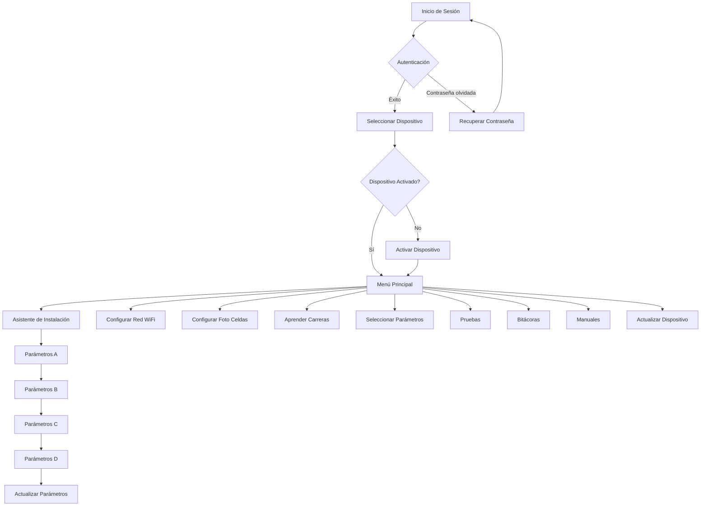

---

## Pantallas de Autenticación

### 1. Login

**Nombre de pantalla:** Login / Inicio de Sesión

**Elementos de la interfaz:**
- Campo de texto: Email/Usuario
- Campo de texto: Contraseña (tipo password)
- Botón: "Iniciar Sesión"
- Enlace: "¿Olvidaste tu contraseña?"
- Validaciones en tiempo real

**Flujo:**

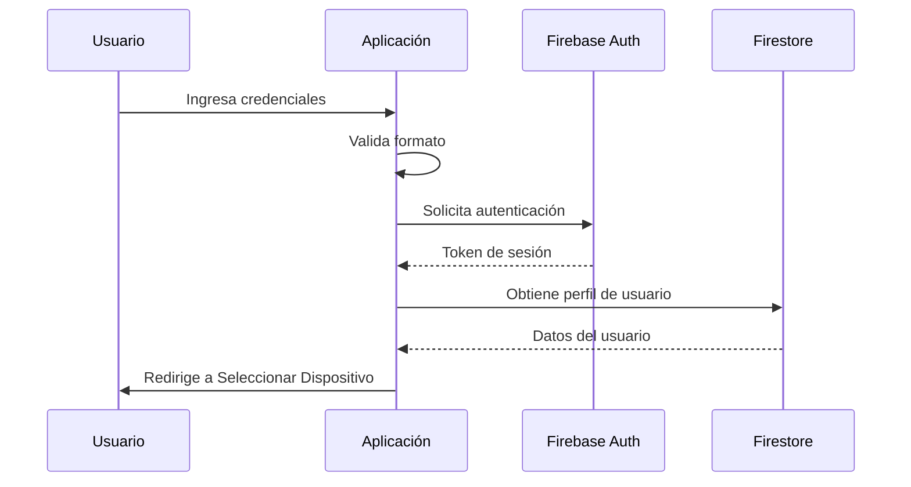

**Estados:**
- Normal: Campos vacíos listos para entrada
- Error: Credenciales incorrectas (mensaje de error visible)
- Cargando: Spinner durante autenticación
- Bloqueado: Usuario bloqueado en el servidor

---

### 2. Recuperar Contraseña

**Nombre de pantalla:** Recuperar Contraseña

**Elementos de la interfaz:**
- Botón de regreso (<)
- Campo de texto: Email
- Botón: "Enviar código de verificación"
- Campo de texto: Código de verificación (6 dígitos)
- Campo de texto: Nueva contraseña
- Campo de texto: Confirmar nueva contraseña
- Botón: "Restablecer contraseña"

**Flujo:**

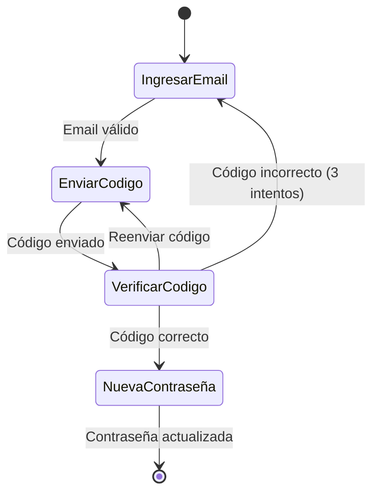

**Validaciones:**
- Email debe tener formato válido
- Código debe ser de 6 dígitos
- Nueva contraseña debe cumplir requisitos de seguridad
- Las contraseñas deben coincidir

---

## Selección y Gestión de Dispositivos

### 3. Seleccionar Dispositivo

**Nombre de pantalla:** Seleccionar Dispositivo

**Elementos de la interfaz:**
- Botón: "Buscar" (escaneo Bluetooth)
- Lista de dispositivos detectados:
  - Nombre del dispositivo (ej: VITA 163459)
  - Modelo (ej: FAC 500)
  - Indicador de señal Bluetooth
  - Estado: Activado/Pendiente
- Botón de actualizar lista

**Diagrama de componentes:**

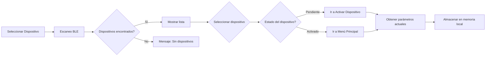

**Funcionalidades:**
- Escaneo automático al entrar a la pantalla
- Filtrado de dispositivos VITA
- Ordenamiento por intensidad de señal
- Indicador visual de dispositivos ya configurados

---

### 4. Activar Dispositivo

**Nombre de pantalla:** Activar Dispositivo

**Elementos de la interfaz:**
- Botón de regreso (<)
- Secciones:
  - **Dispositivos Activados**: Lista de dispositivos ya activados
  - **Dispositivos Pendientes**: Lista de dispositivos sin activar
- Cada dispositivo muestra:
  - Nombre
  - Modelo
  - Número de serie
  - Botón "Activar" (solo para pendientes)

**Proceso de activación:**

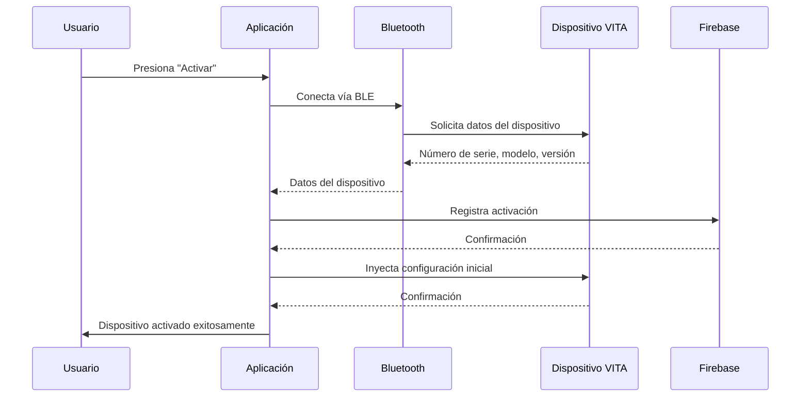

---

## Menú Principal

### 5. Menú Principal

**Nombre de pantalla:** Menú Principal

**Elementos de la interfaz:**
- Header:
  - Botón de regreso (<)
  - Nombre del dispositivo seleccionado
  - Indicador de conexión Bluetooth
- Grid de botones (3 columnas):
  - Asistente de Instalación ⭐
  -Configurar Red WiFi
  - Configurar Foto Celdas
  - Aprender Carreras
  - Seleccionar Parámetros
  - Pruebas
  - Bitácoras
  - Manuales de Usuario
  - Actualizar Dispositivo

**Estructura de navegación:**

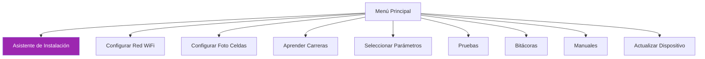

---

## Configuración y Parametrización

### 6. Configurar Red WiFi

**Nombre de pantalla:** Configurar Red

**Elementos de la interfaz:**
- Botón de regreso (<)
- Botón: "Escanear Redes WiFi"
- Lista de redes detectadas:
  - Nombre de la red (SSID)
  - Indicador de intensidad de señal
  - Icono de seguridad (abierta/protegida)
- Modal al seleccionar red:
  - Campo: Contraseña de red
  - Checkbox: Mostrar contraseña
  - Botón: "Conectar"
  - Botón: "Cancelar"

**Flujo de configuración:**

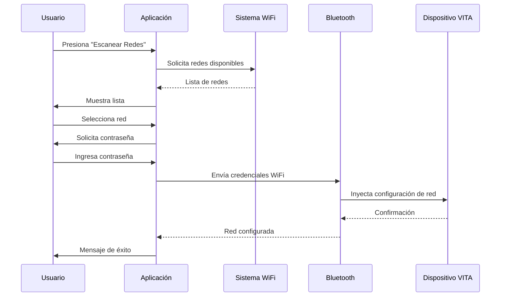

**Consideraciones:**
- Las credenciales WiFi se envían cifradas vía BLE
- Se guarda configuración localmente para futuras referencias
- Se valida la conexión del dispositivo a la red

---

### 7. Configurar Foto Celdas

**Nombre de pantalla:** Configurar Foto Celdas

**Elementos de la interfaz:**
- Botón de regreso (<)
- Sección "Foto Celdas de Apertura":
  - Botón: "Emparejar Apertura"
  - Animación visual del proceso
  - Estado: En espera / Emparejando / Completado
- Sección "Foto Celdas de Cierre":
  - Botón: "Emparejar Cierre"
  - Animación visual del proceso
  - Estado: En espera / Emparejando / Completado
- Sección "Pruebas":
  - Botón con imagen: "Probar Apertura"
  - Botón con imagen: "Probar Cierre"
  - Indicador de estado en tiempo real

**Estados del proceso:**

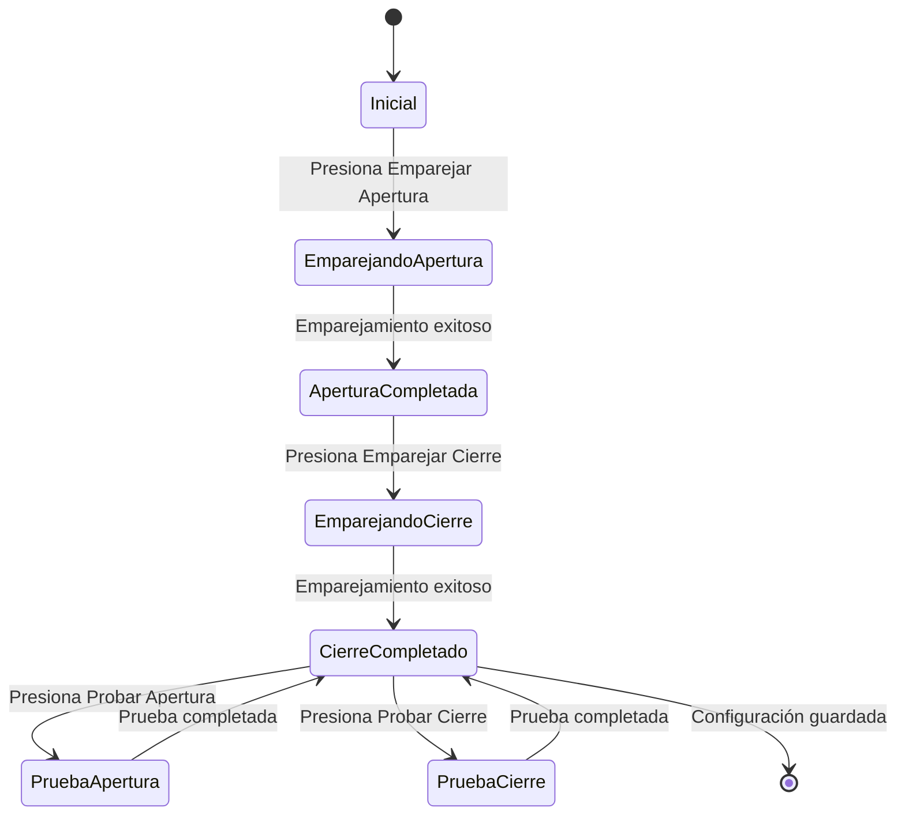

**Animaciones:**
- Animación visual para emparejamiento (sensor detectando señal)
- Feedback en tiempo real durante pruebas
- Indicadores de éxito/error con colores

---

### 8. Aprender Carreras

**Nombre de pantalla:** Aprender Carreras

**Elementos de la interfaz:**
- Botón de regreso (<)
- Título: "Aprender Límites del Dispositivo"
- Animación explicativa:
  - Visualización del motor moviéndose
  - Indicadores de límite superior e inferior
  - Flechas de dirección
- Instrucciones de texto paso a paso
- Botón principal: "Iniciar Aprendizaje"
- Barra de progreso durante el proceso
- Indicadores de estado:
  - En espera
  - Aprendiendo límite superior
  - Aprendiendo límite inferior
  - Completado

**Proceso de aprendizaje:**

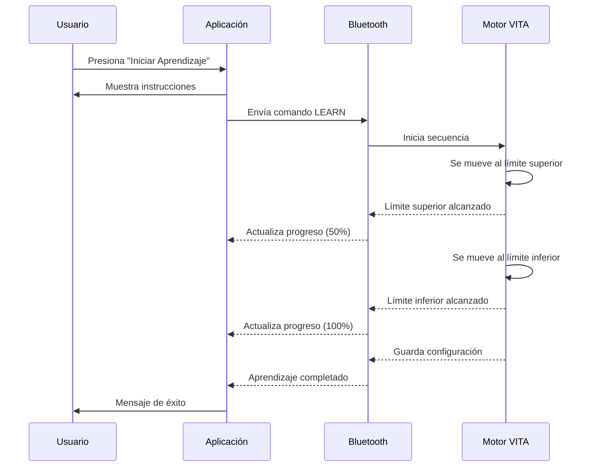

**Retroalimentación visual:**
- Animación sincronizada con el movimiento real del motor
- Porcentaje de progreso
- Tiempo estimado restante
- Mensajes de estado en texto claro

---

### 9. Seleccionar Parámetros

**Nombre de pantalla:** Seleccionar Parámetros

**Elementos de la interfaz:**
- Botón de regreso (<)
- Título: "Configuración Personalizada"
- Descripción: "Selecciona solo los parámetros que deseas modificar"
- Lista de categorías de parámetros:
  - Parámetros de Motor
  - Parámetros de Seguridad
  - Parámetros de Red
  - Parámetros de Sensores
  - Parámetros de Tiempo
- Checkboxes para selección múltiple
- Botón: "Configurar Seleccionados"

**Categorías de parámetros:**

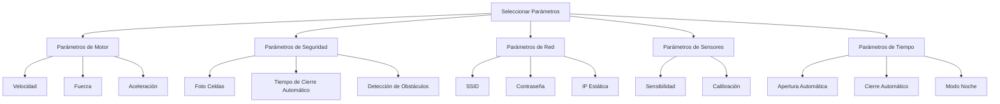

**Funcionalidad:**
- Selección granular de parámetros
- Vista previa de valores actuales vs nuevos
- Validación antes de aplicar cambios
- Confirmación de cambios exitosos

---

## Asistente de Instalación

### 10. Asistente de Instalación (Inicio)

**Nombre de pantalla:** Asistente de Instalación

**Elementos de la interfaz:**
- Botón de regreso (<)
- Título: "Asistente de Instalación"
- Icono de asistente
- Texto descriptivo: "Te guiaremos paso a paso en la configuración de tu dispositivo VITA"
- Sección "Configuración Actual":
  - Muestra parámetros actuales del dispositivo (si existen)
  - Lista de valores con iconos
- Indicador de progreso: Paso 1 de 4
- Botón principal: "Comenzar Configuración"

**Flujo del asistente:**

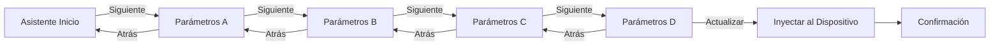

---

### 11. Parámetros A

**Nombre de pantalla:** Parámetros A

**Elementos de la interfaz:**
- Botón de regreso (<)
- Indicador de progreso: Paso 1 de 4
- Título de la sección
- Lista de opciones con checkboxes:
  - Opción 1 con descripción
  - Opción 2 con descripción
  - Opción 3 con descripción
  - Opción 4 con descripción
- Iconos descriptivos para cada opción
- Botón: "Siguiente"

**Tipos de parámetros:**
- Configuraciones de funcionamiento básico
- Opciones binarias (activado/desactivado)
- Selección múltiple permitida
- Valores predeterminados sugeridos

---

### 12. Parámetros B

**Nombre de pantalla:** Parámetros B

**Elementos de la interfaz:**
- Botón de regreso (<)
- Indicador de progreso: Paso 2 de 4
- Título de la sección
- Lista de opciones con toggles/switches:
  - Parámetro 1: ON/OFF
  - Parámetro 2: ON/OFF
  - Parámetro 3: ON/OFF
  - Parámetro 4: ON/OFF
- Descripciones detalladas de cada opción
- Botones:
  - "Atrás"
  - "Siguiente"

**Características:**
- Switches con animación de transición
- Estados claramente diferenciados (ON en verde, OFF en gris)
- Tooltips con información adicional
- Validación de dependencias entre parámetros

---

### 13. Parámetros C

**Nombre de pantalla:** Parámetros C

**Elementos de la interfaz:**
- Botón de regreso (<)
- Indicador de progreso: Paso 3 de 4
- Título de la sección
- Lista de opciones con toggles/switches (similar a Parámetros B)
- Configuraciones de seguridad y sensores
- Botones:
  - "Atrás"
  - "Siguiente"

**Configuraciones incluidas:**
- Parámetros de seguridad
- Configuración de sensores
- Modos de operación
- Alertas y notificaciones

---

### 14. Parámetros D

**Nombre de pantalla:** Parámetros D

**Elementos de la interfaz:**
- Botón de regreso (<)
- Indicador de progreso: Paso 4 de 4
- Título de la sección
- Formulario con campos variados:
  - Campos numéricos con incrementadores (+/-)
  - Sliders para valores graduales
  - Dropdowns para opciones predefinidas
  - Campos de texto para valores personalizados
- Resumen de configuración seleccionada
- Botón principal: "Actualizar Parámetros"
- Botón secundario: "Atrás"

**Proceso de actualización:**

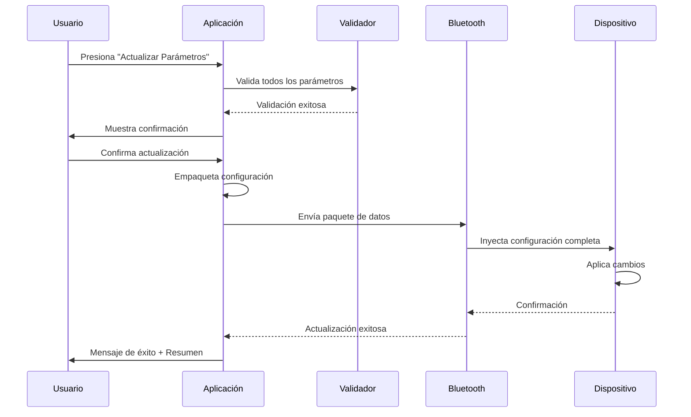

**Validaciones:**
- Rangos permitidos para valores numéricos
- Dependencias entre parámetros
- Conflictos de configuración
- Confirmación antes de aplicar cambios

---

## Funcionalidades Avanzadas

### 15. Pruebas

**Nombre de pantalla:** Pruebas

**Elementos de la interfaz:**
- Botón de regreso (<)
- Título: "Pruebas del Dispositivo"
- Información del dispositivo:
  - Modelo
  - Estado de conexión
  - Ciclos actuales
- Botones de prueba:
  - Abrir Completamente ⬆️
  - Cerrar Completamente ⬇️
  - Detener ⏸️
  - Apertura Parcial (50%)
  - Probar Foto Celdas
  - Probar Sensor de Obstáculos
- Panel de resultados en tiempo real:
  - Estado actual
  - Tiempo de ejecución
  - Errores (si existen)
  - Log de eventos

**Diagrama de estados de prueba:**

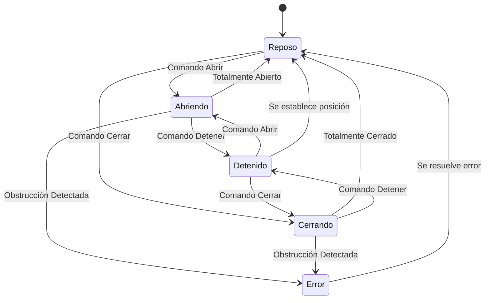

**Registro de pruebas:**
- Timestamp de cada acción
- Duración de operación
- Resultado (éxito/fallo)
- Observaciones

---

### 16. Bitácoras

**Nombre de pantalla:** Bitácoras

**Elementos de la interfaz:**
- Botón de regreso (<)
- Título: "Registrar Actividad"
- Formulario:
  - Dropdown: Tipo de actividad
    - Instalación
    - Mantenimiento
    - Reparación
    - Configuración
    - Prueba
    - Otro
  - Campo de texto: Descripción de la actividad
  - Campo de fecha y hora (prellenado con actual)
  - Checkbox: Adjuntar configuración actual del dispositivo
  - Campo: Técnico responsable
- Botón: "Guardar Bitácora"
- Botón: "Ver Historial"

**Almacenamiento:**

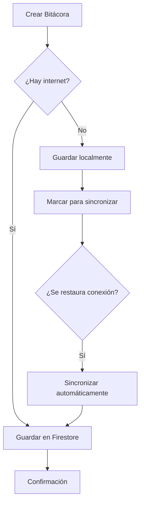

---

### 17. Historial de Bitácoras

**Nombre de pantalla:** Historial de Bitácoras

**Elementos de la interfaz:**
- Botón de regreso (<)
- Filtros:
  - Rango de fechas
  - Tipo de actividad
  - Dispositivo
  - Técnico
- Lista de bitácoras:
  - Fecha y hora
  - Tipo de actividad (con icono)
  - Dispositivo asociado
  - Técnico responsable
  - Botón: "Ver Detalles"
  - Botón: "Descargar"
- Botón: "Descargar Todo" (exportar a PDF/CSV)

**Vista de detalle:**
- Información completa de la bitácora
- Configuración del dispositivo en ese momento
- Fotos adjuntas (si las hay)
- Firma digital del técnico
- Opciones: Compartir, Imprimir, Eliminar

---

### 18. Manuales de Usuario

**Nombre de pantalla:** Manuales de Usuario

**Elementos de la interfaz:**
- Botón de regreso (<)
- Título: "Manuales y Documentación"
- Categorías de dispositivos:
  - VITA FAC 500
  - VITA FAC 400
  - VITA Pistón
  - Otros modelos
- Para cada manual:
  - Nombre del documento
  - Versión
  - Fecha de actualización
  - Tamaño del archivo
  - Icono de descargado (si está disponible offline)
  - Botones:
    - Ver Manual (abre visor PDF)
    - Descargar (para acceso offline)

**Gestión de manuales:**

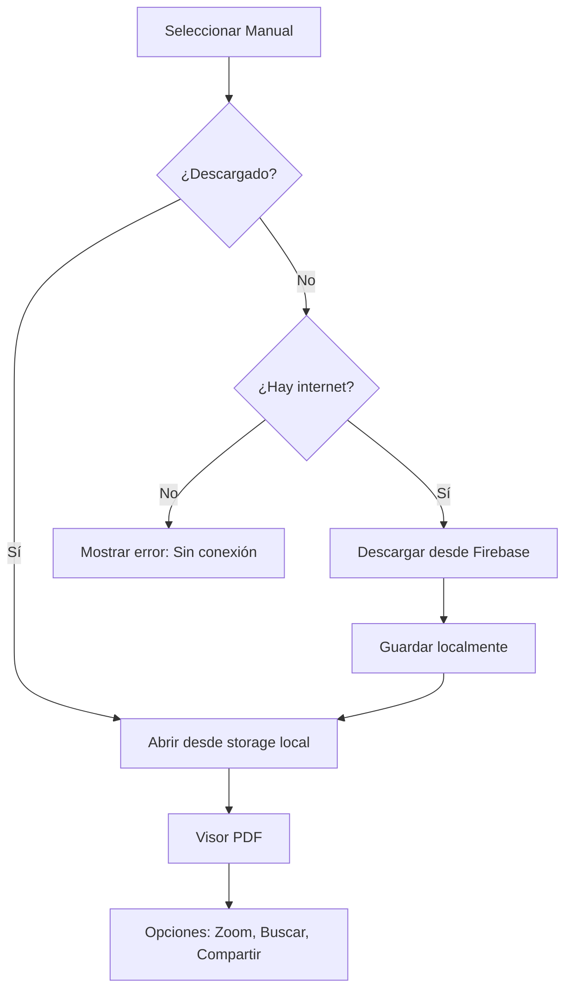

**Características del visor:**
- Zoom in/out
- Búsqueda de texto
- Navegación por páginas
- Modo nocturno
- Compartir vía email/WhatsApp

---

## Actualización y Mantenimiento

### 19. Actualizar Dispositivo

**Nombre de pantalla:** Actualizar Dispositivo

**Elementos de la interfaz:**
- Botón de regreso (<)
- Sección "Información del Dispositivo":
  - Modelo: FAC 500 Vita
  - Número de Serie: 123456
  - Versión Actual: 1.2.3
  - Estado: En línea
  - Detalle: motor casa
  - Ciclos Totales: 1,234
  - Ciclos Actuales: 567
  - Fecha de Activación: 01/01/2020
- Sección "Acciones":
  - Botón: "Resetear Ciclos"
    - Requiere confirmación
    - Opcional: agregar nota o motivo
  - Botón: "Actualizar Firmware vía OTA"
    - Muestra versión disponible
    - Changelog visible
- Servidor de actualizaciones configurado

**Proceso de actualización OTA:**

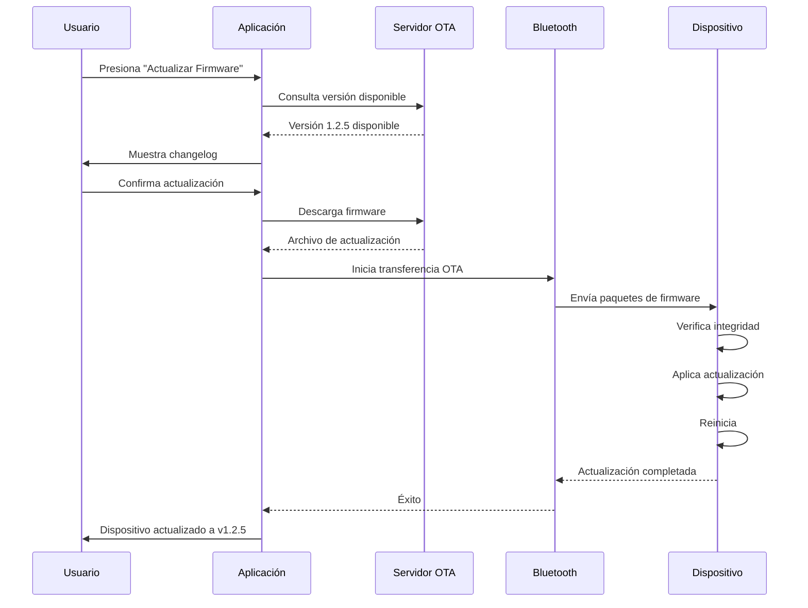

**Consideraciones de seguridad:**
- Verificación de checksum del firmware
- Respaldo automático de configuración antes de actualizar
- Modo de recuperación en caso de fallo
- No permitir interrupciones durante la actualización

---

### 20. Restaurar Equipo

**Nombre de pantalla:** Restaurar Equipo

**Elementos de la interfaz:**
- Botón de regreso (<)
- Advertencias importantes:
  - "Solo se puede cargar un respaldo de un motor del mismo modelo y la misma versión de firmware"
  - "Esto restaurará toda la configuración del dispositivo"
- Sección "Dispositivo Actual":
  - Modelo: FAC 500 Vita
  - No. Serie: 123456
  - Estado: En línea
  - Versión: 1.2.3
- Sección "Respaldos Disponibles":
  - Lista de respaldos con:
    - Fecha y hora
    - Dispositivo origen
    - Modelo
    - Versión de firmware
    - Botón: "Restaurar"
- Botón: "Buscar" (para buscar respaldos adicionales)

**Compatibilidad de respaldos:**

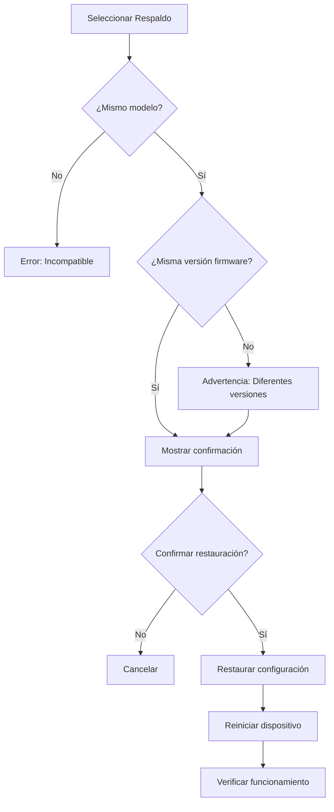

**Proceso de restauración:**
1. Selección del respaldo compatible
2. Confirmación del usuario con advertencia
3. Carga del archivo de respaldo
4. Validación de integridad
5. Aplicación de la configuración
6. Reinicio del dispositivo
7. Verificación post-restauración

---

## Anexo: Especificaciones Técnicas

### Paleta de Colores

- **Primary:** #6A1B9A (Púrpura)
- **Secondary:** #9C27B0 (Púrpura claro)
- **Accent:** #E1BEE7 (Púrpura muy claro)
- **Success:** #4CAF50 (Verde)
- **Warning:** #FF9800 (Naranja)
- **Error:** #F44336 (Rojo)
- **Background:** #FAFAFA (Gris muy claro)
- **Surface:** #FFFFFF (Blanco)
- **Text Primary:** #212121 (Negro casi)
- **Text Secondary:** #757575 (Gris medio)

### Tipografía

- **Font Family:** Montserrat, Roboto, sans-serif
- **Títulos (H1):** 24px, Bold
- **Subtítulos (H2):** 20px, Semi-Bold
- **Cuerpo (Body):** 16px, Regular
- **Captions:** 14px, Regular
- **Botones:** 16px, Medium

### Componentes Reutilizables

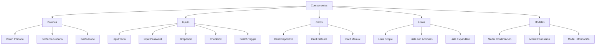

### Iconografía

- **Biblioteca:** Material Design Icons
- **Tamaño:** 24px (default), 32px (destacados)
- **Estilo:** Filled para acciones principales, Outlined para secundarias

### Animaciones y Transiciones

- **Duración estándar:** 300ms
- **Easing:** cubic-bezier(0.4, 0.0, 0.2, 1)
- **Navegación entre pantallas:** Slide transition
- **Modales:** Fade in + Scale up
- **Botones:** Ripple effect
- **Listas:** Staggered animation

### Conectividad

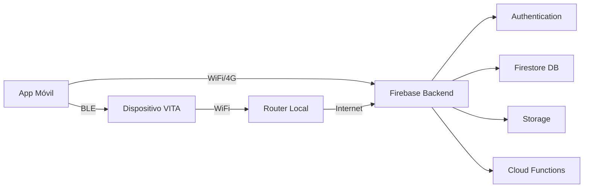

### Gestión de Estados

- **Conexión Bluetooth:** Conectado/Desconectado/Conectando
- **Sincronización Cloud:** Sincronizado/Pendiente/Error
- **Dispositivo:** Online/Offline/Actualizando
- **Configuración:** Guardada/Modificada/Aplicando

---

## Notas Finales

Este documento representa la propuesta de interfaz para la aplicación móvil del instalador. El diseño prioriza:

1. **Usabilidad:** Navegación intuitiva y flujos claros
2. **Eficiencia:** Minimizar pasos para tareas comunes
3. **Confiabilidad:** Funcionamiento offline cuando sea posible
4. **Seguridad:** Validaciones y confirmaciones apropiadas
5. **Escalabilidad:** Arquitectura preparada para nuevas funciones

Para consultas sobre detalles específicos de implementación o mockups visuales adicionales, consulte los archivos PDF adjuntos en la carpeta de documentación.
