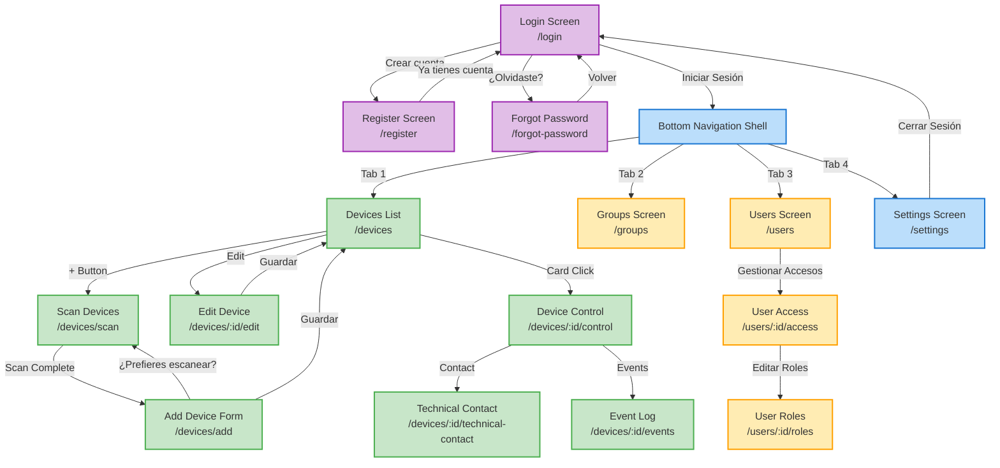

# BGnius VITA - Diagrama de Navegación

Este documento contiene el diagrama completo de navegación entre pantallas de la aplicación.

## Diagrama de Flujo de Navegación



---

## Rutas Definidas

### Rutas de Autenticación (Fuera del Shell)
```
/ (o /login)          → LoginScreen
/register             → RegisterScreen
/forgot-password      → ForgotPasswordScreen
```

### Rutas Principales (Dentro del Shell con Bottom Navigation)

#### Tab 1: Dispositivos
```
/devices                           → DevicesListScreen
/devices/scan                      → ScanDevicesScreen
/devices/add                       → AddDeviceScreen
/devices/:id/control               → DeviceControlScreen
/devices/:id/technical-contact     → TechnicalContactScreen
/devices/:id/events                → EventLogScreen
```

#### Tab 2: Grupos
```
/groups                            → GroupsScreen
```

#### Tab 3: Usuarios
```
/users                             → UsersScreen
/users/:id/access                  → UserAccessScreen
/users/:id/roles                   → UserRolesScreen
```

#### Tab 4: Configuración
```
/settings                          → SettingsScreen
```

---

## Flujos de Usuario Principales

### 1. Onboarding
```
Login → (Nuevo Usuario) → Register → Login → Devices List
Login → (Olvidó Password) → Forgot Password → Login
```

### 2. Gestión de Dispositivos
```
Devices List → Scan Devices → Agregar → Devices List
Devices List → Add Device Form (manual) → Devices List
Devices List → Edit Device → Devices List
Devices List → Device Control
```

### 3. Gestión de Usuarios y Permisos
```
Users → User Access → (Vincular/Desvincular)
User Access → User Roles → (Asignar Permisos)
```

### 4. Navegación Bottom Nav
```
Cualquier tab → Devices / Groups / Users / Settings
Settings → Cerrar Sesión → Login
```

---

## Navegación Programática

### Ejemplo de Navegación con GoRouter

```dart
// Navegar a pantalla
context.go('/devices/scan');

// Navegar con parámetros
context.go('/devices/123/control');

// Navegar y regresar
context.push('/devices/add');

// Regresar
context.pop();

// Reemplazar ruta (ej: después de login)
context.go('/devices');
```

---

## Bottom Navigation Tabs

El `BottomNavShell` gestiona 4 tabs principales:

1. **Devices** (Icono: devices) → `/devices`
2. **Groups** (Icono: groups) → `/groups`
3. **Users** (Icono: people) → `/users`
4. **Settings** (Icono: settings) → `/settings`

La navegación entre tabs mantiene el estado de cada pantalla.

---

## Notas de Implementación

- **Autenticación**: Las rutas auth están fuera del Shell
- **Bottom Navigation**: Persiste en todas las rutas principales
- **Deep Linking**: Todas las rutas soportan navegación directa por URL
- **Estado**: Se preserva al cambiar entre tabs
- **Guards**: Login requerido para todas las rutas dentro del Shell
